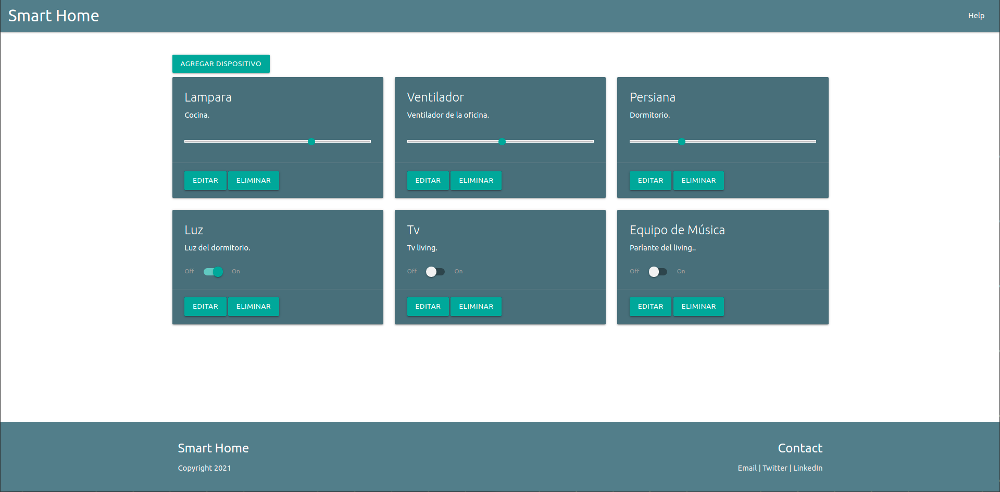

Smart Home Web
=======================

Este proyecto fué realizado para la asignatura Desarrollo de Aplicaciones de la Maestria en Internet de las Cosas de la Universidad de Buenos Aires. Se utilizó como base el proyecto [app-fullstack-base](https://github.com/gotoiot/app-fullstack-base).



### Instalar las dependencias

- Docker
- Docker-compose

### Descargar el código

- Desde una consola:

```
git clone https://github.com/santiagosalamandri/app-fullstack-base.git
```
- Desde la [web](https://github.com/santiagosalamandri/app-fullstack-base).


### Ejecutar la aplicación

- Ejecutar la aplicación correr el comando `docker-compose up` desde la raíz del proyecto.
- Cliente web: [http://localhost:8000/](http://localhost:8000/) 
- Admin de la DB: [localhost:8001/](http://localhost:8001/). 


## Configuraciones de funcionamiento 🔩

Al crearse la aplicación se ejecutan los contenedores de Docker de cada servicio, se crea la base de datos y sus tablas. A continuación podés encontrar info si querés cambiar la estructura de la DB o bien sus configuraciones de acceso.


### Estructura de la DB

La base de datos se llama "smart_home" y pose la siguiente tabla "Device" con los siguiente campos:


| Nombre                   	| Tipo        	|
|--------------------------	|-------------	|
| id (Clave primaria)      	| int(11)     	|
| name                     	| varchar(64) 	|
| description  	            | varchar(128)	|
| state                    	| tinyint(1)  	|
| status                   	| int(11)     	|
| type                     	| int(11)     	|

## Detalles principales 🔍

- id: Clave primaria para determinar el dispositivo.
- name: Nombre del dispositivo.
- description: Descripción del dispositivo.
- type: Tipo de dispositivo. 
   - Tipo "0" para dispositivos "on/off".
   - Tipo "1" para dispositivos "dimerisables".
- state: Estado del dispositivo de tipo "0". 
    - "0" para apagado.
    - "1" para encendido.
- status: Estado del dispositvo de tipo "1".
    - Valores posibles entre 0 y 100.

### Ejecución de servicios

Los servicios de la aplicación se ejecutan sobre **contenedores de Docker**, así se pueden desplegar de igual manera en diferentes plataformas.

### Organización del proyecto


```sh
├── db                          # directorio de la DB
│   ├── data                    # estructura y datos de la DB
│   └── dumps                   # directorio de estructuras de la DB
│       └── smart_home.sql      # estructura con la base de datos "smart_home"
├── doc                         # documentacion general del proyecto
└── src                         # directorio codigo fuente
│   ├── backend                 # directorio para el backend de la aplicacion
│   │   ├── index.js            # codigo principal del backend
│   │   ├── mysql-connector.js  # codigo de conexion a la base de datos
│   │   ├── package.json        # configuracion de proyecto NodeJS
│   │   └── package-lock.json   # configuracion de proyecto NodeJS
│   └── frontend                # directorio para el frontend de la aplicacion
│       ├── js                  # codigo javascript que se compila automáticamente
│       ├── static              # donde alojan archivos de estilos, imagenes, fuentes, etc.
│       ├── ts                  # donde se encuentra el codigo TypeScript a desarrollar
│       └── index.html          # archivo principal del cliente HTML
├── docker-compose.yml          # archivo donde se aloja la configuracion completa
├── README.md                   # este archivo
├── CHANGELOG.md                # archivo para guardar los cambios del proyecto
├── LICENSE.md                  # licencia del proyecto
```

- Para el frontend se modificaron los siguientes archivos:
    - devices.ts: Archivo con la definición de la clase Devices con las características de los dispositivos.
    - handlerInterface.ts: Interfaz a implementar para recibir las respuestas del backend.
    - main.ts: Programa principal donde se gestiona la lógica del frontend.
    - index.html : Archivo utilizado por el navegador para visualar la página web.
- Para el backend se modificaron los siguientes archivos:
    - index.js : Archivo donde se generaron las rutas para procesar las peticiones HTTP y la conexión con la base de datos

## Detalles de implementación 💻

En esta sección podés ver los detalles específicos de funcionamiento del código y que son los siguientes.


### Agregar un dispositivo

- Hacer click en "Agregar dispositivo".
- Completar los datos del nuevo dispositivo (Nombre,Descripción y Tipo).
- Hacer click en "Confirmar".

### Eliminar un dispositivo

- Hacer click en "Eliminar" en la tarjeta que corresponda.

### Actualizar un dispositivo

- Hacer click en el switch o slider del dispositivo que se quiera cambiar su estado.

### Editar un dispositivo

- Hacer click en "Editar".
- Completar los datos del dispositivo (Nombre, Descripción y/o Tipo).
- Hacer click en "Confirmar".


### Frontend

El frontend esta conformado por 3 partes principales:
- Header: Incluye el nombre del proyecto y la ayuda
- Body: Donde se encuentran una matriz de tarjetas con los dispositivos y las acciones disponibles:
    - Un botón para agregar nuevos dispositivos.
    - Cada tarjeta incluye la informacion del dispositivo y la posibilidad de:
        - Cambiar su estado
        - Editar el dispositivo(Nombre,Descricción y Tipo).
        - Eliminar dispostivo.
    
- Footer: Contiene datos de contacto

### Backend

El frontend envía las peticiones HTTP a la backend, y este verifica los parametros. En caso de ser correctos,
realiza la consulta a la base de datos con la acción requerida.

#### Peticiones disponibles:

1) Devolver el estado de los dispositivos.

```json
{
    "url":"http://localhost:8000/devices/",
    "method": "get",
    "request_headers": "application/json",
    "request_body": "",
    "response_code": 200,
    "request_body": {
        "devices": [
            {
                "id": 1,
                "status": true,
                "description": "Kitchen light"
            }
        ]
    },
}
``` 

2) Devolver el estado de un dispositivo en particular.
```json
{
    "url":"http://localhost:8000/devices/:id",
    "method": "get",
    "request_headers": "application/json",
    "request_body": "",
    "response_code": 200,
    "request_body": {
        "devices": 
            {
                "id": 1,
                "status": true,
                "description": "Kitchen light"
            }
    },
}
``` 
3) Agregar un dispositivo.

```json
{
    "url":"http://localhost:8000/devices/",
    "method": "post",
    "request_headers": "application/json",
    "request_body": {
                    "name":"Light",
                    "description": "Kitchen light",
                    "type":0
                    },
    "response_code": 200,
    "request_body": {
        "devices": 
            {
                    "id": 1,
                    "name":"Light",
                    "description": "Kitchen light",
                    "type":0
            }
        
    },
}
``` 

4) Actualizar el estado de un dispositivo.

```json
{
    "url":"http://localhost:8000/devices/:id",
    "method": "post",
    "request_headers": "application/json",
    "request_body": 
                {
                "status": true,
                },
    "response_code": 200,
    "request_body": {
        "devices":{
                "id": 1,
                "status": true,
                }
    },
}
``` 

5) Actualizar los datos de un dispositivo.

```json
{
    "url":"http://localhost:8000/devices/:id",
    "method": "put",
    "request_headers": "application/json",
    "request_body": {
                    "name":"Light",
                    "description": "Kitchen light",
                    "type":0
                    },
    "response_code": 200,
    "request_body": {
        "devices": {
                    "id":1,
                    "name":"Light",
                    "description": "Kitchen light",
                    "type":0
                    }
    },
}
``` 
6) Borrar un dispositivo.

```json
{
    "url":"http://localhost:8000/devices/:id",
    "method": "delete",
    "request_headers": "application/json",
    "request_body": "",
    "response_code": 200,
    "request_body": {
        "devices":{
                "id": 1,
                }
    },
}
``` 

## Tecnologías utilizadas 🛠️


* [Docker](https://www.docker.com/) - Ecosistema que permite la ejecución de contenedores de software.
* [Docker Compose](https://docs.docker.com/compose/) - Herramienta que permite administrar múltiples contenedores de Docker.
* [Node JS](https://nodejs.org/es/) - Motor de ejecución de código JavaScript en backend.
* [MySQL](https://www.mysql.com/) - Base de datos para consultar y almacenar datos.
* [PHPMyAdmin](https://www.phpmyadmin.net/) - Administrador web de base de datos.
* [Material Design](https://material.io/design) - Bibliotecas de estilo responsive para aplicaciones web.
* [TypeScript](https://www.typescriptlang.org/) - Superset de JavaScript tipado y con clases.


## Autor 👥


**[Santiago Salamandri](https://github.com/santiagosalamandri)**.


## Licencia 📄

Este proyecto está bajo Licencia ([MIT](https://choosealicense.com/licenses/mit/)). Podés ver el archivo [LICENSE.md](LICENSE.md) para más detalles sobre el uso de este material.
